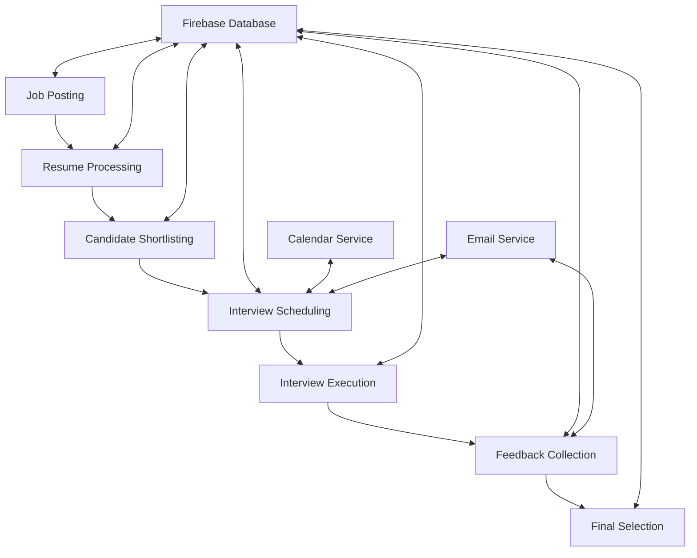

# Interview Agent System - Current Workflow

This document provides an overview of the current workflow in the DocuSign Interview Agent System, including the shortlisting and scheduling processes that were recently updated.

## System Architecture Overview

The system is built on a microservices-based architecture with the following key components:

- **FastAPI Backend**: Core API server handling all requests and orchestrating the interview process
- **Firebase Database**: Stores job postings, candidate data, interview records, and other persistent data
- **AI/LLM Integration**: Powers intelligent job analysis, candidate screening, and interview question generation
- **Google Calendar Integration**: Handles scheduling and management of interview slots
- **Email Notification Service**: Sends automated communications to candidates and interviewers

## Main Workflows

### 1. Job Posting Workflow

1. **Job Creation**
   - HR/Recruiter creates job posting with title, description, requirements, and experience level
   - Job Analysis Agent enhances job description and extracts key requirements
   - Job posting is stored in Firebase with a unique job_id

2. **Resume Processing**
   - Resumes are uploaded and associated with a specific job_id
   - Resume Parser extracts structured information from documents
   - AI model generates fit scores based on resume-job alignment
   - Candidate profiles are stored in Firebase with fit scores

### 2. Candidate Shortlisting Workflow

1. **Shortlisting Process**
   - The system identifies top N candidates based on AI fit scores
   - Interview Shortlist Service creates interview records in Firebase
   - Each candidate's interview process includes multiple rounds (configurable)

2. **Interview Setup**
   - For each shortlisted candidate:
     - Interview rounds are defined with round types and interviewers
     - Initial scheduling uses automated time slot allocation
     - Firebase stores interview status and scheduling information

### 3. Interview Scheduling Workflow

1. **Calendar Integration**
   - Interview Scheduling Coordinator uses GetInterviewCandidatesTool to retrieve valid interview details
   - Calendar Service creates Google Calendar events for each interview round
   - Google Meet links are generated automatically
   - Firebase interview records are updated with scheduling details

2. **Email Notifications**
   - Email notifications are sent to both candidates and interviewers
   - Notifications include interview details, Google Meet links, and preparation information

### 4. Interview Rescheduling Workflow

1. **Reschedule Request**
   - Candidate or interviewer requests rescheduling
   - Interview Scheduling Coordinator accesses Firebase DB for context
   - New time slot is proposed and validated

2. **Reschedule Process**
   - Old calendar event is cancelled
   - New event is created with updated details
   - All parties are notified of the change
   - Firebase interview record is updated with new scheduling information

### 5. Interview Feedback Workflow

1. **Feedback Collection**
   - Interviewers submit feedback through the platform
   - Feedback is analyzed and structured
   - Interview records in Firebase are updated with feedback data

2. **Candidate Evaluation**
   - AI models analyze feedback across rounds
   - Candidates are ranked based on interview performance
   - Final recommendations are generated

## Data Flow Between Components

## Key Agents and Tools

### Agents

1. **Job Analysis Expert**
   - Analyzes job postings and extracts key requirements
   - Creates structured job profiles

2. **Candidate Screening Specialist**
   - Evaluates resumes against job requirements
   - Calculates AI fit scores for candidates

3. **Interview Planning Strategist**
   - Designs interview processes for each role
   - Creates appropriate evaluation criteria

4. **Interview Scheduling Coordinator**
   - Manages the logistics of interview scheduling
   - Handles rescheduling and calendar management

### Tools

1. **Firebase Context Tools**
   - GetInterviewCandidatesTool: Retrieves interview candidate information
   - GetJobsTool: Retrieves job posting information
   - GetCandidatesTool: Retrieves candidate profile information

2. **Core Agent Tools**
   - CreateJobPostingTool: Creates new job postings
   - ProcessResumesTool: Processes resumes for a job
   - ShortlistCandidatesTool: Shortlists and schedules interviews
   - RescheduleInterviewTool: Reschedules interviews

## Recent Enhancements

1. **Firebase Context Integration**
   - Added database context tools for accessing valid IDs and records
   - Improved error handling for missing data

2. **Dynamic Agent Tool Assignment**
   - Enhanced Interview Scheduling Coordinator with database context tools
   - Improved interview rescheduling with better database querying

3. **Intelligent Scheduling Logic**
   - Improved time slot allocation for interviews
   - Better handling of timezone differences

## API Endpoints

The system exposes several REST API endpoints:

1. **Job Management**
   - `POST /jobs` - Create a new job posting
   - `GET /jobs` - List all job postings
   - `GET /jobs/{job_id}` - Get job details

2. **Candidate Management**
   - `POST /candidates` - Add a new candidate
   - `GET /candidates` - List all candidates
   - `GET /job/{job_id}/candidates` - List candidates for a job

3. **Interview Management**
   - `POST /shortlist` - Shortlist candidates and schedule interviews
   - `POST /reschedule` - Reschedule an interview
   - `GET /interviews` - List all interviews
   - `GET /interviews/{interview_id}` - Get interview details

4. **Agent Interactions**
   - `POST /agent/query` - Send a query to the agent system
   - `POST /agent/feedback` - Submit feedback on agent performance

## Usage Flow

1. Create job posting through the API or UI
2. Upload candidate resumes and process them
3. Shortlist candidates using the shortlisting endpoint
4. View scheduled interviews in the calendar
5. Send reschedule requests as needed
6. Collect feedback after interviews
7. Make final selection decisions

## Error Handling

The system implements several error handling mechanisms:

1. **Database Validation**
   - Checks for valid IDs before operations
   - Fallbacks to retrieve context when direct IDs aren't available

2. **Scheduling Conflicts**
   - Detection of double-bookings
   - Alternative time slot suggestions

3. **Notification Failures**
   - Retry logic for failed notifications
   - Alternative notification methods when email fails
